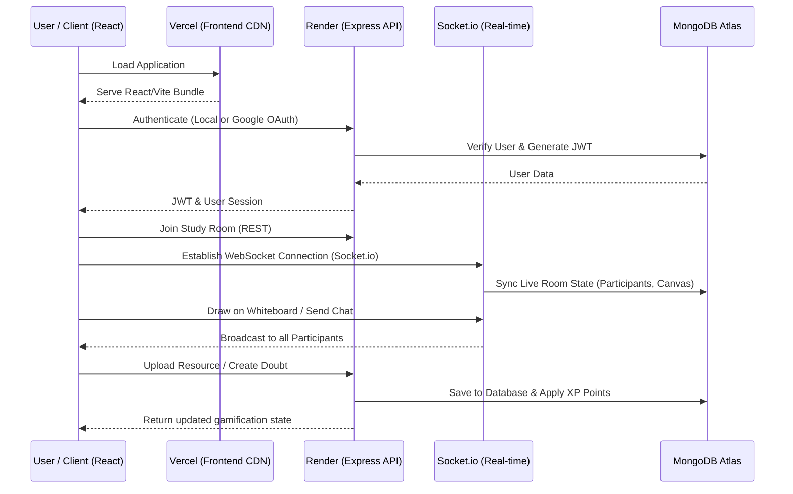

# 🎓 Vault - Collaborative Study Platform

A production-level full-stack application designed for students to collaborate, share resources, and solve doubts in real-time. Built using the **MERN Stack** and **Socket.io**.

---

## 🌐 Live Deployment Links

- **Frontend Application**: [Study Vault (Vercel)](https://study-vault-frontend-eight.vercel.app)
- **Backend API**: [Study Vault API (Render)](https://study-vault-og.onrender.com)
- **API Health Check**: [Check Backend Health](https://study-vault-og.onrender.com/api/health)

---

## 🔄 Detailed Application Flow

Vault provides a seamless collaborative experience. Here is the end-to-end data flow when a user interacts with the platform:

### 1. Authentication Flow
- User logs in via standard Email/Password or **Google OAuth 2.0**.
- The Express backend validates the credentials against MongoDB.
- A JWT (`jsonwebtoken`) is returned to the client and stored in local storage for authenticated requests.

### 2. Real-Time Collaboration Flow
- Upon entering a **Study Room**, the React client establishes a connection to the Express server via `socket.io-client`.
- Actions such as sending chat messages or drawing on the shared Whiteboard are emitted as events to the server.
- The server broadcasts these events to all users connected to the same `roomId`.
- The `RoomState` is periodically synced with MongoDB to ensure persistence.

### 3. Gamification Flow
- When a user answers a doubt or uploads a highly-voted resource, the backend calculates XP (Experience Points).
- XP is mapped to Levels and Tiers (`Bronze`, `Silver`, `Gold`, `Platinum`, `Diamond`).
- Real-time Leaderboards pull sorted aggregate data from MongoDB.

---

## 📊 Database Schemas (MongoDB / Mongoose)

The application uses a NoSQL architecture managed via Mongoose.

### `User` Schema
Handles authentication and gamification tracking.
| Field | Type | Description |
| --- | --- | --- |
| `username` | String | Unique identifier |
| `email` | String | Unique email |
| `password` | String | Bcrypt-hashed password (for local auth) |
| `googleId` | String | Used for Google OAuth linking |
| `xp` | Number | Experience points |
| `level` | Number | Calculated automatically via pre-save hooks |
| `tier` | Virtual | Dynamic tier ranking based on level |

### `RoomState` Schema
Persists real-time collaboration artifacts.
| Field | Type | Description |
| --- | --- | --- |
| `roomId` | String | Associated room ID |
| `notes` | String | Collaborative text editor state |
| `whiteboard` | Array | Array of drawing paths/strokes |
| `chat` | Array | History of messages |
| `participants` | Array | Currently active users |

### `Doubt` Schema
Manages community Q&A.
| Field | Type | Description |
| --- | --- | --- |
| `question` | String | The doubt topic |
| `description` | String | Elaborate description |
| `roomId` | String | Room where it was asked |
| `bountyPoints` | Number | XP reward for answering |
| `answers` | Array | Sub-document of submitted answers |
| `isResolved` | Boolean | Status of the doubt |

### `Resource` Schema
Manages uploaded academic materials.
| Field | Type | Description |
| --- | --- | --- |
| `title` | String | Document title |
| `topic` | String | Categorization topic |
| `fileUrl` | String | Cloud URL of the uploaded file |
| `upvotes` | Array | Users who upvoted |
| `downvotes` | Array | Users who downvoted |

---

## 📦 Packages and Dependencies

### Frontend (`package.json`)
Deployed as a static Single Page Application (SPA) on Vercel.

| Package | Version | Purpose |
| --- | --- | --- |
| `react` & `react-dom` | `^19.2.5` | UI Component architecture |
| `react-router-dom` | `^7.15.0` | Client-side routing |
| `socket.io-client` | `^4.8.3` | Real-time WebSocket communication |
| `@react-oauth/google` | `^0.13.5` | Google One Tap and OAuth integration |
| `tailwindcss` & `@tailwindcss/vite` | `^4.3.0` | Utility-first CSS styling system |
| `vite` | `^8.0.10` | Lightning-fast build tool |

### Backend (`package.json`)
Deployed as a persistent Web Service on Render.

| Package | Version | Purpose |
| --- | --- | --- |
| `express` | `^5.2.1` | REST API framework |
| `mongoose` | `^9.6.2` | MongoDB Object Data Modeling (ODM) |
| `socket.io` | `^4.8.3` | Real-time bidirectional event-based communication |
| `bcryptjs` | `^3.0.3` | Password hashing algorithm |
| `jsonwebtoken` | `^9.0.3` | Secure token generation and validation |
| `google-auth-library` | `^10.6.2` | Google token verification for backend |
| `multer` | `^2.1.1` | Multipart/form-data handling for file uploads |
| `dotenv` | `^17.4.2` | Environment variable management |
| `cors` | `^2.8.6` | Cross-Origin Resource Sharing enablement |

---

## 🛠️ Infrastructure & Tooling Setup

- **MongoDB Atlas**: Cloud NoSQL database cluster with IP whitelisting (`0.0.0.0/0`) enabled for dynamic cloud hosting.
- **Google Cloud Console**: OAuth 2.0 Credentials configured with specific Authorized JavaScript Origins for the Vercel frontend.
- **Render Blueprint (`render.yaml`)**: Infrastructure-as-code setup for 1-click backend deployment without storing secrets in the repository.
- **Vercel CLI**: Used to bind `VITE_BACKEND_URL` and perform optimized production builds.
- **Node.js**: The entire stack is built on Node.js (Runtime for backend, Build-tool for frontend).

---

Developed by Ara Sadaf 🚀

